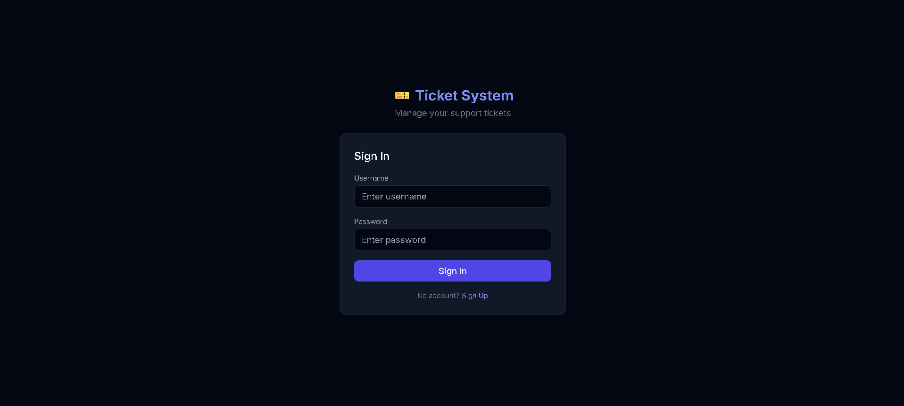
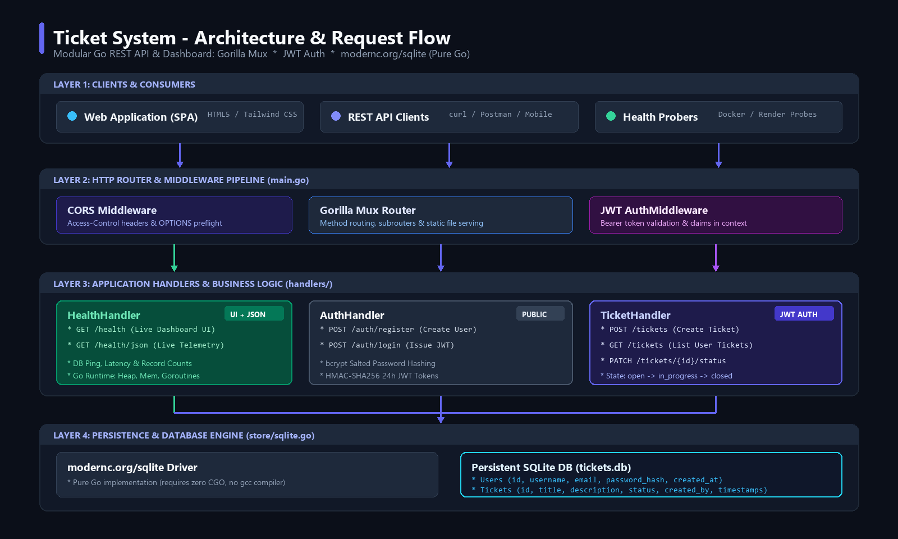
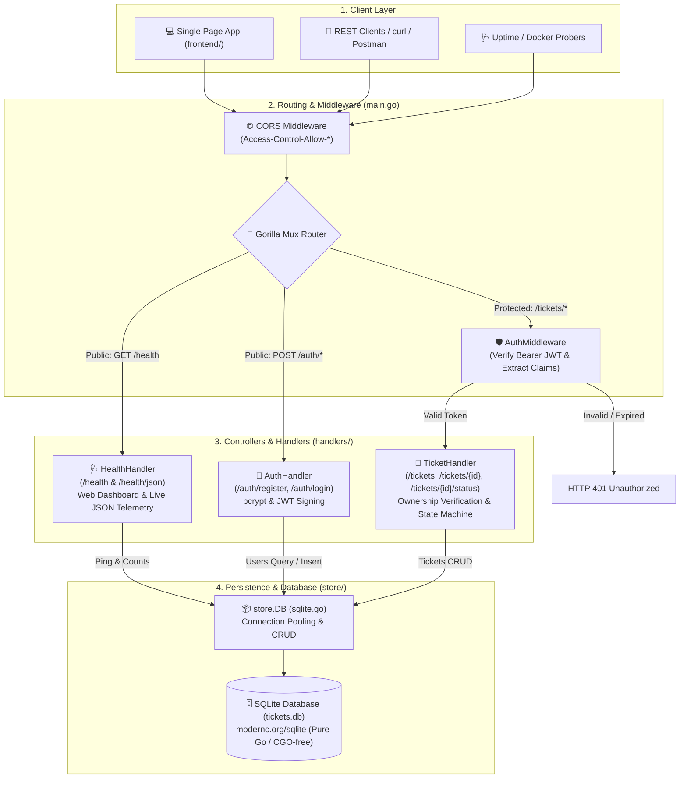
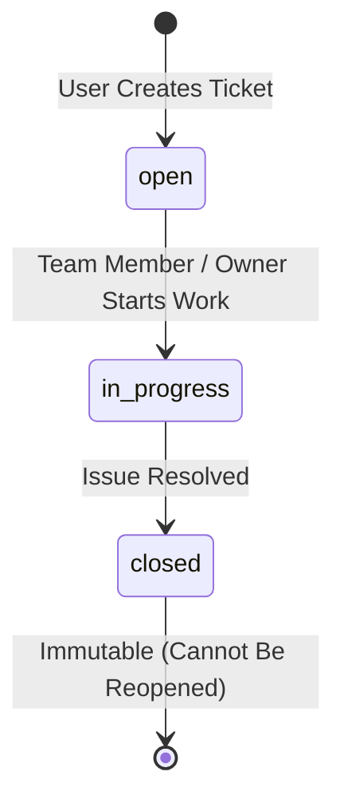

# Ticket System

A production-ready REST API backend and interactive management dashboard for support tickets built with **Go (Golang)**. Features secure user authentication (bcrypt + JWT), role-free user data isolation, ticket lifecycle workflows, comprehensive health monitoring with a live web dashboard, and pure-Go SQLite persistence.

---

## 📸 Screenshots

| Ticket Dashboard | System Status & Health Dashboard |
|---|---|
|  | *Live telemetry & health monitoring UI at `/health`* |

---

## 🏛️ System Architecture & Workflow

### Architectural Overview



The project adheres to a clean, decoupled 4-layer architecture ensuring high performance, zero external C-dependencies, and strict separation of concerns:



### Ticket Status Lifecycle



---

## ⚡ Tech Stack

- **Language:** Go (1.23+)
- **HTTP Router:** [`gorilla/mux`](https://github.com/gorilla/mux)
- **Database:** SQLite via [`modernc.org/sqlite`](https://gitlab.com/cznic/sqlite) — pure Go, requires **zero CGO/gcc**
- **Authentication:** JWT tokens via [`golang-jwt/jwt/v5`](https://github.com/golang-jwt/jwt) (24-hour expiration)
- **Password Hashing:** `golang.org/x/crypto/bcrypt` (secure salted hashing)
- **Frontend:** Responsive Vanilla HTML5, Tailwind CSS, modern dark UI served directly by the Go binary

---

## 🚀 Getting Started

### Prerequisites
- [Go 1.21+](https://go.dev/dl/) or [Docker](https://www.docker.com/)

### Run Locally

```bash
# 1. Clone repository
git clone https://github.com/gauravjain0377/ticket-system
cd ticket-system

# 2. Download dependencies
go mod tidy

# 3. (Optional) Set up environment variables
cp .env.example .env

# 4. Start the server
go run main.go
```

Server will start on: **http://localhost:8080**
- 📱 **Web Application:** http://localhost:8080/
- 🩺 **Live Health & Status Dashboard:** http://localhost:8080/health
- 📊 **Raw JSON Telemetry:** http://localhost:8080/health?format=json (or `/health/json`)

---

## 🐳 Docker Setup

The repository features a multi-stage `Dockerfile` creating an ultra-lightweight Alpine container:

```bash
# Build Docker image
docker build -t ticket-system .

# Run Docker container
docker run -p 8080:8080 -v ticket-data:/data -e DB_PATH=/data/tickets.db ticket-system
```

---

## ⚙️ Environment Configuration

Configure the application using environment variables or a `.env` file:

| Variable | Default | Description |
|---|---|---|
| `PORT` | `8080` | Port the HTTP server binds to |
| `JWT_SECRET` | `default-secret-change-me-in-production` | Secret key used to sign and verify HMAC-SHA256 JWTs |
| `DB_PATH` | `tickets.db` | Path to persistent SQLite database file |

---

## 🩺 System Health & Monitoring

The system features an enterprise-grade `/health` service designed for both **human operations teams** and **automated container orchestrators** (Docker, Kubernetes, AWS ECS, Render):

### 1. Interactive Web Dashboard (`GET /health`)
Visiting `/health` directly in any web browser presents a real-time status control center:
- **Operational Banner:** Live pulsing status indicators (`healthy` vs `degraded`).
- **Database Diagnostics:** SQLite connectivity check, query ping latency, total registered users, and active tickets.
- **Runtime Metrics:** Go version, active goroutines, heap memory (`MB`), total system memory allocated, and GC cycles.
- **Interactive JSON Viewer:** In-browser JSON explorer with a one-click clipboard copy utility.
- **Active Endpoints Directory:** Live routing table with HTTP methods, authorization levels, and descriptions.

### 2. JSON Telemetry API (`GET /health?format=json` or `GET /health/json`)
Automated probes or API clients requesting `application/json` automatically receive full telemetry:

```bash
curl -i http://localhost:8080/health?format=json
```

#### Sample Response:
```json
{
  "status": "healthy",
  "service": "EvaBharat Ticket System API",
  "version": "1.0.0",
  "timestamp": "2026-09-08T17:20:00Z",
  "uptime": "2h 14m 32s",
  "uptime_seconds": 8072,
  "database": {
    "status": "connected",
    "driver": "sqlite (modernc.org/sqlite, pure-Go)",
    "latency_ms": 0.38,
    "total_users": 12,
    "total_tickets": 34
  },
  "system": {
    "go_version": "go1.23.0",
    "os": "windows",
    "arch": "amd64",
    "num_cpu": 8,
    "num_goroutines": 4,
    "memory_alloc_mb": 4.12,
    "memory_sys_mb": 18.5,
    "num_gc": 2
  },
  "endpoints": [
    {
      "method": "GET",
      "path": "/health",
      "auth": "Public",
      "description": "System health check & interactive dashboard"
    },
    {
      "method": "POST",
      "path": "/auth/register",
      "auth": "Public",
      "description": "Register new user account"
    },
    {
      "method": "POST",
      "path": "/auth/login",
      "auth": "Public",
      "description": "Authenticate and retrieve JWT token"
    },
    {
      "method": "GET",
      "path": "/tickets",
      "auth": "Bearer JWT",
      "description": "List all tickets for authenticated user"
    },
    {
      "method": "POST",
      "path": "/tickets",
      "auth": "Bearer JWT",
      "description": "Create a new support ticket"
    },
    {
      "method": "PATCH",
      "path": "/tickets/{id}/status",
      "auth": "Bearer JWT",
      "description": "Update ticket status (open -> in_progress -> closed)"
    }
  ]
}
```

---

## 📖 API Reference

All protected endpoints require the HTTP Authorization header:
```http
Authorization: Bearer <your_jwt_token>
```

### 1. Authentication Endpoints

#### Register User
```http
POST /auth/register
Content-Type: application/json

{
  "username": "gaurav",
  "email": "gaurav@example.com",
  "password": "strongPassword123"
}
```
*Response: `201 Created` with created user object (excluding password hash).*

#### Login
```http
POST /auth/login
Content-Type: application/json

{
  "username": "gaurav",
  "password": "strongPassword123"
}
```
*Response: `200 OK`*
```json
{
  "token": "eyJhbGciOiJIUzI1NiIsInR5cCI6IkpXVCJ9..."
}
```

---

### 2. Ticket Management Endpoints

#### Create Ticket
```http
POST /tickets
Authorization: Bearer <token>
Content-Type: application/json

{
  "title": "Database connection latency on dashboard",
  "description": "Noticeable latency during initial page load"
}
```
*Response: `201 Created` with ticket model.*

#### List My Tickets
```http
GET /tickets
Authorization: Bearer <token>
```
*Response: `200 OK` with JSON array of tickets owned by the authenticated user.*

#### Get Single Ticket
```http
GET /tickets/{id}
Authorization: Bearer <token>
```

#### Update Ticket Status
```http
PATCH /tickets/{id}/status
Authorization: Bearer <token>
Content-Type: application/json

{
  "status": "in_progress"
}
```
*Valid statuses:* `open`, `in_progress`, `closed`. Enforces strict state transitions (`closed` tickets are terminal).

---

## 🚦 HTTP Status Code Reference

| Status Code | Description | Cause |
|---|---|---|
| `200 OK` | Request succeeded | Successful GET, PATCH, or Login |
| `201 Created` | Resource created | Successful User Registration or Ticket Creation |
| `400 Bad Request` | Validation failure | Missing required fields, invalid JSON, or invalid status transition |
| `401 Unauthorized` | Auth missing or invalid | Missing or expired Bearer JWT token |
| `403 Forbidden` | Access denied | Attempting to view or modify another user's private ticket |
| `404 Not Found` | Not found | Requested ticket ID does not exist |
| `409 Conflict` | Unique constraint failed | Username or email already registered |
| `500 Internal Error` | Server error | Unexpected database or internal failure |
| `503 Unavailable` | Health check degraded | Database ping failure during health probe |

---

## 📁 Repository Layout

```
evabharat_assignment/
├── assets/
│   ├── architecture.svg    # Vector architecture diagram
│   └── ticket.png          # App screenshot
├── config/
│   └── config.go           # Environment configuration loader
├── frontend/
│   ├── app.js              # SPA logic (Auth state, API client, CRUD)
│   ├── index.html          # Modern dark-mode UI with live status badge
│   └── style.css           # Custom styles & animations
├── handlers/
│   ├── auth.go             # Registration & Login endpoints
│   ├── health.go           # Health check, JSON telemetry & Status UI
│   └── ticket.go           # Ticket management & state transition engine
├── middleware/
│   └── auth.go             # JWT validation & user context injection
├── models/
│   ├── ticket.go           # Ticket data model
│   └── user.go             # User data model
├── store/
│   └── sqlite.go           # SQLite database layer & metrics collection
├── utils/
│   ├── json.go             # Standardized HTTP JSON writer
│   ├── jwt.go              # Token generation and verification
│   └── password.go         # bcrypt hash & comparison helpers
├── Dockerfile              # Production multi-stage Alpine Dockerfile
├── main.go                 # Application bootstrap & route registration
├── go.mod & go.sum         # Go module definition and dependencies
└── README.md               # Documentation & system guides
```

---

## 🔒 Security & Design Highlights

1. **Zero-CGO SQLite Engine:** Utilizes `modernc.org/sqlite` so builds remain fully portable, light, and cross-compilable without gcc toolchain dependencies.
2. **Strict User Data Isolation:** User tickets are strictly isolated at the database query level (`WHERE created_by = ?`), preventing unauthorized data leakage.
3. **Password Security:** Passwords are never stored in plaintext and are salted using standard `bcrypt` cost factor.
4. **Resilient Health Probes:** The health check endpoint executes real `Ping()` and entity counts against the SQLite engine to guarantee that green checks reflect real database availability.
